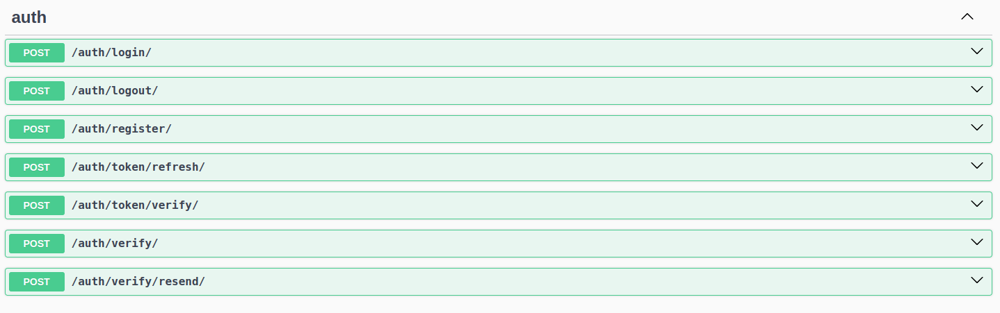

# Django JWT Auth

<h3>Introduction:</h3>

This is a project for user authentication using the JWT system, with a primary focus on efficiency, reusability in different
projects, and high security.

The django_simple_jwt package has been used for JWT implementation.

<h3>UserLogin model</h3>
In this project, we have a model called UserLogin which stores user login information such as refresh_token,
device_name, and ip_address. With this setup, we can effectively manage user logins and also implement restrictions
on logged-in devices.

<h3>Token Encryption:</h3>

Tokens are sent to the client in an encrypted form, ensuring that no one can see the contents of the token's payload.
This provides excellent security. Additionally, by encrypting the tokens, we can include any necessary information
that needs to be sent in each request for the user in the payload. However, it is not recommended to include highly
sensitive information in the payload.

User login and account verification are done by default using OTP codes. However, you can easily modify it according
to your preference, as explained in the documentation provided below.

Having a good caching mechanism, such as Redis or Memcached, is also recommended in real-world projects.

Please refer to the documentation below for further details on how to use and customize this project.

<h3>How to use this project</h3>
Since the authentication requirements vary for different systems, it is not possible to create a project that can meet
our needs without any modifications.

One system may use email and login code for authentication, while another system may require a username and password,
and so on. Therefore, it is not feasible to handle all these scenarios in a single project.

However, in this project, I have simplified the process as much as possible. You only need to customize the services.py
module and define its corresponding views and URLs.
Operations such as token encryption, token retrieval, and account logout do not require any modifications.

To understand how to write the services.py module for your own project, refer to the views.py section of the user_auth
app and read the documentation for each view. In general, you need to make any desired changes while ensuring that the
output of the functions is compatible with the views. If you require more extensive modifications, you can also
customize the views.

Feel free to explore and contribute to this project. Any feedback and suggestions are welcome.

<h3>
توضیح برای سمت کلاینت
</h3>

/accounts/login/

ثبت و نام و رجیستر هردو با همین api انجام میشه.
شماره موبایل رو میگیره و برای کاربر اس ام اس میکنه‌. کدی که برمیگردونه اگه 200 بود یعنی اس ام اس ارسال شده و اگه 400 بود شماره شماره موبایلش یا اشتباهه. اگه 406 بود درخواستش not acceptable هستش و شماره موبایلش بیش از حد مجاز توی 24 ساعت گذشته درخواست کد ورود به حساب کرده.
(فعلا چون سرویس اس ام اس وصل نیست وقتی کد 200 میده توی response.body کد رو برمیگردونه تا برای تست اشتفاده کنیم)

/accounts/verify/

بعد از اینکه کاربر شمارشو وارد کرد و کد رو گرفت. میفرستیش تو یه صفحه تا کد رو وارد کنه. وقتی کد رو وارد کرد. شماره موبایل کاربر همراه با کدی که وارد کرده رو توی این آدرس میفرستی.
اگه کد 400 داد یعنی کد وارد شده صحیح نیست. وقتی 200 میده توی response.body  اطلاعات پروفایل به علاوه توکن رو دریافت میکنی. یعنی اگه 200 بود کاربر رو مستقیم میفرستیش به پروفایلش

توکن هم jwt هستش که دو بخش داره اکسس و رفرش دربارش توضیح نمیدم مطمئنم باهاش آشنایی

/accounts/refresh/

وقتی که اکسس توکن مدت زمانش تموم شد. رفرش توکن رو توی این آدرس میفرستی و اگه توکن معتبر بود برات یه اکسس توکن جدید میده

/accounts/token/verify/

توکن رو میفرستی اگه 200 داد یعنی معتبر هستش اگه نه معتبر نیست

/accounts/profile/

اطلاعات پروفایل کاربر رو میگیری.
در کل برای احراز شدن کاربر باید به این شکل اکسس توکن رو توی کوکی بفرستی:
key: Authorization
value: Bearer access_token

/accounts/profile/update/

متدش چون partial update هستش پس patch هستش. تنها چیزی که کاربر میتونه آپدیت کنه fullname هستش.

/accounts/logout/

وقتی کاربر logout میکنه. جز اینکه توکنش رو از سمت کلاینت حذف میکنی. توی این آدرس رفرش توکن رو میفرستی تا توکنش نامعتبر بشه

/accounts/verify/resend/

در برخی سیستم ها اگه قابلیت این وجود داشته باشه که کد جدید دوباره برای کاربر ارسال بشه از این api استفاده میشه.
شماره موبایل رو میگیره

